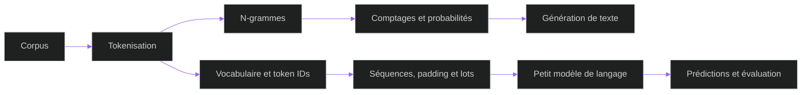

<center>

</center>

<center>

<br>

</center>

**Google DeepMind: AI Research Foundations — Solutions** est mon grimoire de cours : notebooks, expérimentations et notes autour des petits modèles de langage. Le dépôt documente le travail réalisé dans le cours **Train a Small Language Model** du [parcours officiel Google Skills](https://www.skills.google/paths/3135) — des modèles n-grammes jusqu'à l'entraînement et l'évaluation d'un SLM.

<center>

</center>

## 領域展開 · La genèse

Ce dépôt accompagne le parcours **Google DeepMind: AI Research Foundations**. Son contenu actuel se concentre sur le cours [Train a Small Language Model](https://www.skills.google/paths/3135/course_templates/1453) : chaque notebook suit les étapes d'un laboratoire pratique, avec activités de code, solutions et essais de génération. Il s'agit de notes et de travaux personnels d'apprentissage, pas d'un dépôt officiel de Google ou de DeepMind.

## 術式 · Le grimoire des labs

Parcours les fichiers dans l'ordre pour passer des statistiques de séquences aux premières expériences de modélisation. Les notebooks peuvent s'ouvrir dans GitHub ou directement dans Google Colab.

| Ordre | Grimoire | Ce qu'on y explore |
|---|---|---|
| 01 | [Expérimenter avec les modèles n-grammes](course_1/gdm_lab_1_2_experiment_with_n_gram_models.ipynb) · [Colab](https://colab.research.google.com/github/ACADEMIC-AND-PERSONAL-PROJECTS/Google-DeepMind-AI-Research-Foundations-solutions/blob/main/course_1/gdm_lab_1_2_experiment_with_n_gram_models.ipynb) | Tokeniser un corpus, construire des n-grammes, compter leurs occurrences, estimer des probabilités et générer du texte. |
| 02 | [Préparer les données d'un SLM](course_1/gdm_lab_1_4_prepare_the_dataset_for_training_a_slm.ipynb) · [Colab](https://colab.research.google.com/github/ACADEMIC-AND-PERSONAL-PROJECTS/Google-DeepMind-AI-Research-Foundations-solutions/blob/main/course_1/gdm_lab_1_4_prepare_the_dataset_for_training_a_slm.ipynb) | Construire le vocabulaire, créer les correspondances token/indice, puis encoder et décoder les séquences. |
| 03 | [Entraîner son propre petit modèle de langage](course_1/gdm_lab_1_5_train_your_own_small_language_model.ipynb) · [Colab](https://colab.research.google.com/github/ACADEMIC-AND-PERSONAL-PROJECTS/Google-DeepMind-AI-Research-Foundations-solutions/blob/main/course_1/gdm_lab_1_5_train_your_own_small_language_model.ipynb) | Préparer et remplir les séquences, constituer les lots, entraîner un SLM puis examiner ses prédictions et générations. |

<details>
<summary>Ouvrir le laboratoire complémentaire et les notes de terrain</summary>

| Fichier | Rôle |
|---|---|
| [`notebook.ipynb`](Train%20A%20Small%20Language%20Model%20lab/notebook.ipynb) | Laboratoire complémentaire : fonctions utilitaires, tokenizer caractère et génération à partir d'un modèle n-gramme. |
| [`main.py`](Train%20A%20Small%20Language%20Model%20lab/main.py) | Point d'entrée Python du projet local. |
| [`simple_word_tokenization.py`](course_1/simple_word_tokenization.py) | Implémentation pédagogique d'un tokenizer par mots, avec encodage et décodage. |
| [Notes sur les schémas](assets/NOTES.md) | Contexte des illustrations de raisonnement réalisées avec Excalidraw. |
| [Schéma n-grammes](assets/probleme_ngrammes.png) · [version finale](assets/probleme_ngrammes_final_version.png) | Deux cartes de réflexion autour du problème des n-grammes. |

</details>

<center>

</center>

## 符 · Le fil de recherche

Les laboratoires font évoluer une représentation simple du texte vers une première boucle d'entraînement et d'évaluation.



## 電 · La forge

Les notebooks du cours s'exécutent dans Google Colab. Le projet local du laboratoire complémentaire déclare ses dépendances dans `pyproject.toml` et les verrouille dans `uv.lock`.

| Couche | Outil / version déclarée |
|---|---|
| Langage | Python `>=3.12` |
| Notebooks | Jupyter / IPython kernel |
| Kernel | `ipykernel 7.3.0` |
| Calcul numérique | `NumPy 2.5.3` · `pandas 3.0.6` |
| Modèles | `Keras 3.15.1` · `TensorFlow 2.21.0` |
| Environnement | `uv` avec `pyproject.toml` et `uv.lock` |

## 起動 · Démarrage rapide

Pour commencer sans installation, ouvre l'un des notebooks dans Colab avec le lien associé dans le tableau du grimoire.

Pour lancer le laboratoire local, installe [uv](https://docs.astral.sh/uv/), puis :

```bash
git clone https://github.com/ACADEMIC-AND-PERSONAL-PROJECTS/Google-DeepMind-AI-Research-Foundations-solutions.git
cd Google-DeepMind-AI-Research-Foundations-solutions
cd "Train A Small Language Model lab"
uv sync
uv run --with jupyter jupyter lab notebook.ipynb
```

## 品質 · Notes de lecture

Le dépôt est un carnet pédagogique : les exercices et leurs solutions sont conservés dans les notebooks, avec un script Python séparé pour la tokenisation. Il ne déclare pas de suite de tests automatisés ; les résultats et exemples produits pendant les laboratoires se consultent dans les notebooks.

<center>

<br><br>
<b>領域展開 · DOMAIN EXPANSION — SMALL LANGUAGE MODELS</b>
<br><br>
Carnet de recherche et d'apprentissage tenu par <b><a href="https://github.com/khadimmbaye0">@khadimmbaye0</a></b>
</center>
