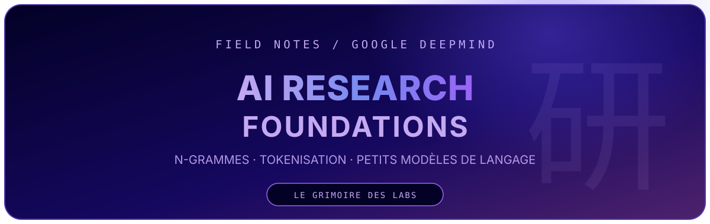
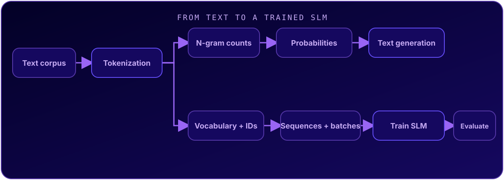
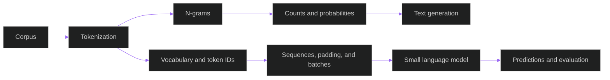

<center>

</center>

<center>

<br>

</center>

**Google DeepMind: AI Research Foundations — Solutions** is my learning grimoire: notebooks, experiments, and notes on small language models. It documents my work in **Train a Small Language Model**, part of the [official Google Skills learning path](https://www.skills.google/paths/3135), from n-gram models to training and evaluating an SLM.

<center>

</center>

## Origins

This repository follows the **Google DeepMind: AI Research Foundations** learning path. Its current focus is the [Train a Small Language Model](https://www.skills.google/paths/3135/course_templates/1453) course: each notebook works through a hands-on lab with coding activities, solutions, and text-generation experiments. These are personal study notes and solutions, not an official Google or DeepMind repository.

## The lab grimoire

Follow the files in order, from sequence statistics to your first language-model experiments. Open each notebook on GitHub or launch it directly in Google Colab.

| Order | Grimoire | What you'll explore |
|---|---|---|
| 01 | [Experiment with N-Gram Models](course_1/gdm_lab_1_2_experiment_with_n_gram_models.ipynb) · [Colab](https://colab.research.google.com/github/ACADEMIC-AND-PERSONAL-PROJECTS/Google-DeepMind-AI-Research-Foundations-solutions/blob/main/course_1/gdm_lab_1_2_experiment_with_n_gram_models.ipynb) | Tokenize a corpus, build n-grams, count occurrences, estimate probabilities, and generate text. |
| 02 | [Prepare the Dataset for an SLM](course_1/gdm_lab_1_4_prepare_the_dataset_for_training_a_slm.ipynb) · [Colab](https://colab.research.google.com/github/ACADEMIC-AND-PERSONAL-PROJECTS/Google-DeepMind-AI-Research-Foundations-solutions/blob/main/course_1/gdm_lab_1_4_prepare_the_dataset_for_training_a_slm.ipynb) | Build a vocabulary and token/index mappings, then encode and decode sequences. |
| 03 | [Train Your Own Small Language Model](course_1/gdm_lab_1_5_train_your_own_small_language_model.ipynb) · [Colab](https://colab.research.google.com/github/ACADEMIC-AND-PERSONAL-PROJECTS/Google-DeepMind-AI-Research-Foundations-solutions/blob/main/course_1/gdm_lab_1_5_train_your_own_small_language_model.ipynb) | Prepare and pad sequences, create batches, train an SLM, and inspect its predictions and generated text. |

### After Course 1 · Build a SLM Lab

Continue with the [Build a SLM Lab notebook](Train%20A%20Small%20Language%20Model%20lab/notebook.ipynb) in `Train A Small Language Model lab/`, or [open it in Colab](https://colab.research.google.com/github/ACADEMIC-AND-PERSONAL-PROJECTS/Google-DeepMind-AI-Research-Foundations-solutions/blob/main/Train%20A%20Small%20Language%20Model%20lab/notebook.ipynb). This follow-up lab covers helper functions and data loading, character-level tokenization, and text generation with an n-gram model.

<details>
<summary>Open the companion lab and field notes</summary>

| File | Purpose |
|---|---|
| [`main.py`](Train%20A%20Small%20Language%20Model%20lab/main.py) | Python entry point for the local project. |
| [`simple_word_tokenization.py`](course_1/simple_word_tokenization.py) | Educational word tokenizer with encoding and decoding methods. |
| [Diagram notes](assets/NOTES.md) | Context for the reasoning diagrams created with Excalidraw. |
| [N-gram diagram](assets/probleme_ngrammes.png) · [final version](assets/probleme_ngrammes_final_version.png) | Two visual notes exploring the n-gram problem. |

</details>

<center>

</center>

## Research flow

The labs move from a simple text representation to a first training and evaluation loop.

<center>

</center>

<details>
<summary>View the Mermaid source</summary>



</details>

## The toolkit

The course notebooks run in Google Colab. The companion local lab declares its dependencies in `pyproject.toml` and pins them in `uv.lock`.

| Layer | Tool / declared version |
|---|---|
| Language | Python `>=3.12` |
| Notebooks | Jupyter / IPython kernel |
| Kernel | `ipykernel 7.3.0` |
| Numerical computing | `NumPy 2.5.3` · `pandas 3.0.6` |
| Models | `Keras 3.15.1` · `TensorFlow 2.21.0` |
| Environment | `uv` with `pyproject.toml` and `uv.lock` |

## Quick start

To get started without installing anything, open one of the notebooks in Colab using its link in the grimoire table.

To run the companion lab locally, install [uv](https://docs.astral.sh/uv/), then:

```bash
git clone https://github.com/ACADEMIC-AND-PERSONAL-PROJECTS/Google-DeepMind-AI-Research-Foundations-solutions.git
cd Google-DeepMind-AI-Research-Foundations-solutions
cd "Train A Small Language Model lab"
uv sync
uv run --with jupyter jupyter lab notebook.ipynb
```

## Reading notes

This is a learning repository: exercises and solutions live in the notebooks, alongside a standalone Python tokenizer. No automated test suite is configured; experiment results and examples are available in the notebooks.

<center>

<br><br>
<b>DOMAIN EXPANSION — SMALL LANGUAGE MODELS</b>
<br><br>
Research notes and learning experiments by <b><a href="https://github.com/khadimmbaye0">@khadimmbaye0</a></b>
</center>
